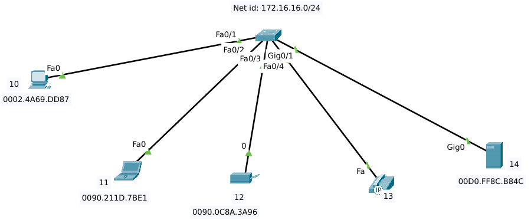
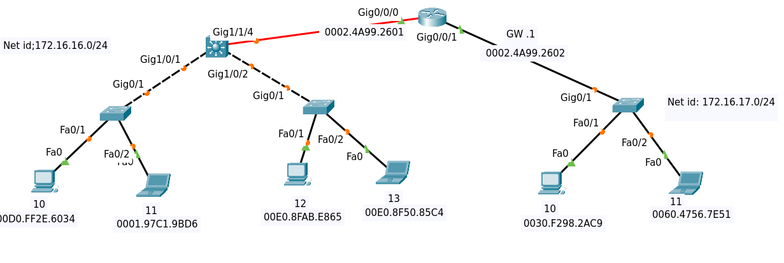

# Part 1,2,3:

#### Hub wicknesses:
- collision
- Broadcast
- security

#### APIPA:
```When a Windows computer isn't able to communicate with the DHCP server, something called Automatic Private IP Addressing (APIPA) kicks in. It assigns the computer an IP address that starts with 169.254. These IP addresses are only useful on local networks, not the internet```

-----------------------------------------------------------------
## Senario1:



------------------------------------------------------------
#### ARP:


- ##### Points:
    - Cisco switches stores the new mac address of each interface in some plcae called ``` mac address table ``` which is visible by ```show mac-address-table```
    - Windows devices also store the new mac addresses, visible by ``` arp -a ```
    - Arp ping:
       - ICMP Ping not Working
       - Chicking if firewall is blocking
       - L2 Packet Pings using Arp
       - Firewall passed in reply is available
         
    - Updating Mac Address ===> used by hackers
       - GARP: announcing new mac address using ARP
       - Devices Update Arp Tables
       - Mac Address Take Over
         
    - New IP ===> Announcd by ARP:
       - 1- No reply ===> Change
       - 2- reply ===> IP forbidden
       -  3- off PC ===> Dup IP
         
    - switch foolding: 
       - cleared ARP-Table in a Switch
       - an L2 packet having new Mac Address arrives
       - Switch Boradcast all interfces 
-----------------------------------------------------------------
## Senario2:



------------------------------------------------------------

