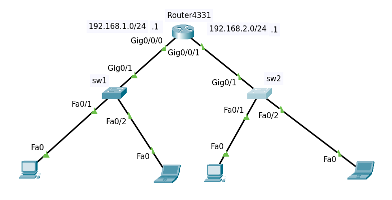

## Part 1,2:

## Senario 3:

----------------------------------------------------
- #### Points:
    - default setup program: `help`
    - set ip in Windows: `ncpa.cpl `
    - to see running config: `# show running-config `
    - attach description to config: `(c-if) description {message} `
 
----------------------------------------------------- 
#### switche Virtual Interface (SVI):
- `(c) interface vlan1`
- `(c-if) no shut`
- `ip address {ip} {subnet}
- default Gateway in switch: `# ip default-gateway {ip}`

------------------------------------------------------
#### Speet & Duplex:
- to set: `# speed {x} ` & `# duplex {x}`
- default: `# no speed` & ` no duplex`

-------------------------------------------------------

#### Cisco discovery Protocol (CDP):
- `# show cdp`
- `# show cdp neighbors {details}`
- `# no cdp`
- `(c-if) no cdp enable`
- to select multiple interfces `interface range fast 0/1 - 24`

---------------------------------------------------------
