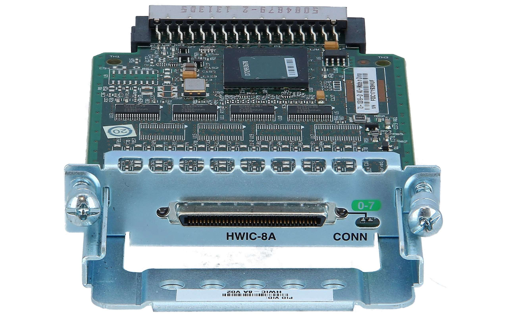

# Sercuring the connection:
 - choosing the console line: ` (c) line console 0 `
 - set password `password {pass}`
 - enable the login process: `(c-line) login ` opposite: `no login`
 - to see the users: `(#) show user`
 - hiding the password in config by hash & salt: `(c) service password-encyption` opposite : `no " " "`
 - to see the config based on console lines: `(#) show run | begin line`
 - ####  Adding User:
    - `(c) username admin password {pass}` or with encrypted pass : `(c) user admin secret {pass} `
       - entering md5: `(c) user admin secret 5 {hash of pass}`
    - enabling authentication for each line : `(c-line) login local `
    - privilieged user: `(c) username {name} privilige {level} secret {pass} `
    - ##### privileges:
        - 15: full
        - 0: lowest
        - 1: default
        - 2 to 14: configurable
    - ##### enable password: `(c) enable secret {password}`

----------------------------------------------------------------------------------
### HWIC: High speed Wan Interface:


- by using octal cables we can use router as a terminal

-----------------------------------------------------------------------------------

#### some configs:
-  default exec-timeout:
   - no exec-timeout
   - exec-timeout 0
- cancel log interrupts: `logging syncronous` 

-----------------------------------------------------------------------------------
### Enabling Telnet:
- ##### VTY: Virtual Teletype
   - `(c) line vty {number}`
- ##### Telnet steps:
   - if switch: set ip to vlan interface
   - enable pass required
   - `(c) line vty {number or range: 0 11}`
      - `(c-line) login local`
   - Add User
  
 command: telnet { ip } or { ip }


 ##### Limiting telnet:
 - `transport input ?`
 - `transport output ?`

##### DNS: 
- ` ip name-server {ip}`

----------------------------------------------------------------------------
### Enabling SSH (Secure Shell):
- step 1: change hostname
- step 2: `(c) ip domain-name test.local`
- step 3: `(c) crypto key generate rsa`
- step 4: `(c) ip ssh version 2` ---> limiting version
- step 5: add user
- step 6: enable secret
- step 7: `(c) line vty {range: x y}`
- step 8: `(c-line) login local`
- step 9: `(c-line) transport input ssh` ----> canceling telnet
-----------------------------------------------------------------------------
### AAA:


-----------------------------------------------------------------------------
#### some configs:

```cisco
enable
!
conf t
!
username admin secret 123456
!
line console 0
  login local
  no exec-timeout
  end
!
exit 
```

----------------------------------------------------------------------------------

```cisco

en
conf t
!
hostname r1
!
int g 0/0/0
  no sh
  ip add 192.168.1.1 255.255.255.0
  exit
!
int g 0/0/1
  no sh
  ip add 192.168.2.1 255.255.255.0
  exit
!
line console 0
  login local
  exit
!
username admax secret 123456
!
enable secret 321
end
!
wr
```
